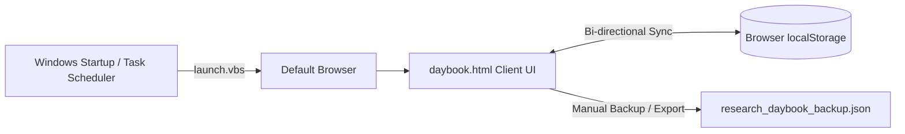

# 📖 Research Daybook

<div align="center">

[](LICENSE)
[](https://github.com/Kamran5H/ResearchDaybook)
[](https://github.com/Kamran5H/ResearchDaybook)
[](https://github.com/Kamran5H/ResearchDaybook)
[](https://github.com/Kamran5H/ResearchDaybook)

**An ultra-minimalist, single-file, offline-first personal research journal and daily focus console designed for scientists, engineers, and deep thinkers.**

[Explore Features](#-key-features) • [Quickstart](#-quick-start) • [Architecture](#-architecture) • [Workflow](#-daily-workflow) • [License](#-license)

</div>

---

## 🌟 Executive Overview

**Research Daybook** is an distraction-free, zero-dependency daily laboratory and engineering log. Built directly into a single self-contained HTML5 application, it stores all entries securely in client-side `localStorage`, requiring **no database, no backend server, and no cloud subscriptions**.

Whether tracking experimental protocols, computational chemistry runs, code refactoring milestones, or daily priorities, Research Daybook provides instant startup, keyboard-friendly navigation, and automated Windows scheduled task triggers.

---

## 🚀 Key Features

- **⚡ Zero Setup & Instant Cold-Start**: Double-click `daybook.html` and start writing immediately in any modern browser (Chrome, Edge, Firefox, Brave).
- **🔒 100% Air-Gapped & Private**: Your research data never leaves your machine. All logs, milestones, and notes persist strictly in local browser storage.
- **🎯 "Next Action" Anchor Banner**: Prominently spotlights your immediate high-leverage objective to combat cognitive fatigue and context-switching.
- **📅 Daily Continuous Rollover**: Automatically groups entries by date while preserving uncompleted goals and high-priority action items.
- **💾 JSON Export & Backup**: One-click full database dump to formatted JSON for automated backups or version control.
- **🖥️ Seamless Windows Shell Integration**: Includes `launch.vbs` (silent background execution) and `Install-Task.ps1` (registers an automated Windows Task Scheduler trigger).

---

## 🏗️ Architecture & Data Flow



---

## 📁 Repository Structure

```text
ResearchDaybook/
├── daybook.html            # Complete self-contained single-page application
├── daybook.ico             # High-resolution desktop application icon
├── launch.vbs              # Silent VBScript launcher for background initialization
├── Install-Task.ps1        # PowerShell script to register automated daily startup task
├── Install (run once).cmd  # One-click Windows administrative installer
├── .gitignore              # Environment & cache exclusion rules
└── LICENSE                 # Open-source MIT License
```

---

## ⚡ Quick Start

### Option 1: Direct Execution
Simply double-click [`daybook.html`](daybook.html) in your file explorer to launch the daybook immediately.

### Option 2: Windows Background Auto-Launch Setup
To have Research Daybook greet you every morning when you log in:

1. Right-click [`Install (run once).cmd`](Install%20(run%20once).cmd) and select **Run as Administrator**.
2. The installer calls [`Install-Task.ps1`](Install-Task.ps1), which schedules a lightweight Windows Task.
3. The task silently calls [`launch.vbs`](launch.vbs) on system login without command prompt popups.

---

## 📋 Daily Workflow

| Section | Purpose |
| :--- | :--- |
| **Next Action** | Single imperative task you are currently working on. Keeps focus sharp. |
| **Today's Priorities** | Top 3-5 core objectives for the active work session. |
| **Laboratory / Engineering Log** | Timestamped freeform notes, command outputs, observations, and findings. |
| **Session Review** | Evening reflection on breakthroughs, hurdles, and tomorrow's trajectory. |

---

## 📜 License

This project is open-source and released under the [MIT License](LICENSE).  
Copyright (c) 2024-2026 **Kamran Ashraf**.
